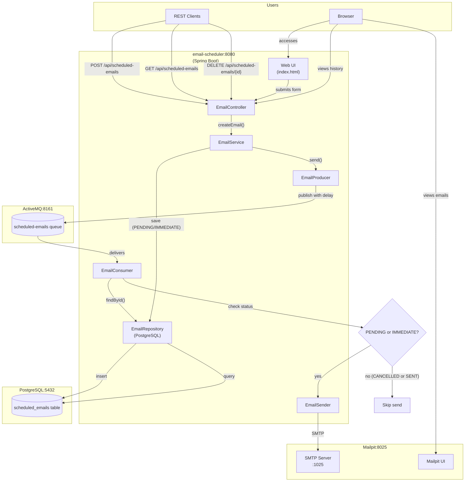

# spring-boot-activemq-mailpit

[](LICENSE)
[](https://buymeacoffee.com/ivan.franchin)

The goal of this project is to demonstrate how to implement an email scheduling application using [`Spring Boot`](https://docs.spring.io/spring-boot/index.html), [`ActiveMQ`](https://activemq.apache.org/), [`PostgreSQL`](https://www.postgresql.org/), and [`Mailpit`](https://mailpit.axllent.org/). The application allows users to send emails immediately or schedule them for a later time. It also provides a web UI to view the history of scheduled emails and cancel pending ones.

## Proof-of-Concepts & Articles

On [ivangfr.github.io](https://ivangfr.github.io), I have compiled my Proof-of-Concepts (PoCs) and articles. You can easily search for the technology you are interested in by using the filter. Who knows, perhaps I have already implemented a PoC or written an article about what you are looking for.

## Project Overview



## Applications

- ### email-scheduler

  `Spring Boot` Java web application that provides REST API and a web UI for sending emails immediately or scheduling emails. It uses `ActiveMQ` as the message broker to handle email scheduling, `PostgreSQL` for persistence (tracking email status: `PENDING`, `IMMEDIATE`, `SENT`, `CANCELLED`, `FAILED`), and `Mailpit` as a local SMTP server to capture and display sent emails.

  Endpoints:
  ```text
    POST /api/scheduled-emails -d {"to": "...", "subject": "...", "body": "...", "delayInMillis": ...}
     GET /api/scheduled-emails
  DELETE /api/scheduled-emails/{id}
  ```

## Prerequisites

- [`Java 25`](https://www.oracle.com/java/technologies/downloads/#java25) or higher;
- A containerization tool (e.g., [`Docker`](https://www.docker.com), [`Podman`](https://podman.io), etc.)

## Start Docker Compose services

In a terminal and inside the `spring-boot-activemq-mailpit` root folder run:
```bash
podman compose up -d
```

## Running application using Maven

In a terminal and inside the `spring-boot-activemq-mailpit` root folder, run the command below:
```bash
./mvnw clean spring-boot:run --projects email-scheduler
```

## Simulation

- Open a browser and access `Mailpit` at http://localhost:8025
- Open another browser and access `email-scheduler` application at http://localhost:8080
- Fill in the email scheduling form. You can send the email immediately or schedule it for a later time.
- Emails sent with "Send Now" do not appear in the history panel.
- You can view all scheduled (pending) emails in the history panel below the form.
- You can cancel any pending scheduled email by clicking the cancel (X) button.
- Check the `Mailpit` at the scheduled time to see the received email.

## Demo


## Useful links

- **ActiveMQ**

  - Access http://localhost:8161
  - Click `Manage ActiveMQ broker`.
  - To log in, use `admin` for both username and password.

- **Mailpit**

  - Access http://localhost:8025

- **PostgreSQL**

  ```bash
  docker exec -it postgres psql -U postgres -d emaildb
  select * from scheduled_emails;
  ```

## Shutdown

To stop and remove Docker Compose containers, network, and volumes, go to a terminal and, inside the `spring-boot-activemq-mailpit` root folder, run the following command:
```bash
podman compose down -v
```

## Running Tests

In a terminal and inside the `spring-boot-activemq-mailpit` root folder, run the following command:
```bash
./mvnw clean test
```

## Code Formatting

Uses [Spotless Maven Plugin](https://github.com/diffplug/spotless/tree/main/plugin-maven) + [Google Java Format](https://github.com/google/google-java-format) (Java) and [Prettier](https://prettier.io/) (JS/HTML) for automated formatting.

- **Check formatting:**

  ```bash
  ./mvnw spotless:check
  ```

- **Auto-fix formatting:**

  ```bash
  ./mvnw spotless:apply
  ```

## How to optimize the GIF in the documentation folder

\[**Medium**\]: [**How I Reduce GIF and Screenshot Sizes for My Technical Articles on macOS**](https://medium.com/itnext/how-i-reduce-gif-and-screenshot-sizes-for-my-technical-articles-on-macos-7fea331afc68)

## Support

If you find this useful, consider buying me a coffee:

<a href="https://buymeacoffee.com/ivan.franchin"></a>

## License

This project is licensed under the [MIT License](./LICENSE).
