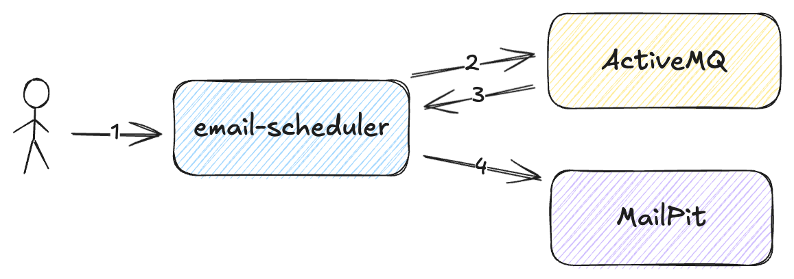
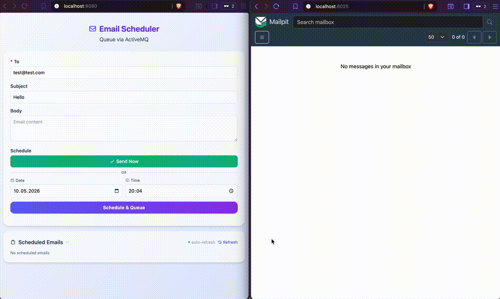

# spring-boot-activemq-mailpit

[](LICENSE)
[](https://buymeacoffee.com/ivan.franchin)

This project shows how to implement an email scheduling application.

## Proof-of-Concepts & Articles

On [ivangfr.github.io](https://ivangfr.github.io), I have compiled my Proof-of-Concepts (PoCs) and articles. You can easily search for the technology you are interested in by using the filter. Who knows, perhaps I have already implemented a PoC or written an article about what you are looking for.

## Applications

- ### email-scheduler

  [Spring Boot](https://spring.io/projects/spring-boot) Java web application that provides REST API and a web UI for sending emails immediately or scheduling emails. It uses [`ActiveMQ`](https://activemq.apache.org/) as the message broker to handle email scheduling and [`MailPit`](https://mailpit.axllent.org/) as a local SMTP server to capture and display sent emails.

  Endpoint:
  - `POST /api/scheduled-emails -d {"to": "...", "subject": "...", "body": "...", "delayInMillis": ...}` - Send an email immediately or schedule it for a later time.

## Project Diagram



## Prerequisites

- [`Java 25`](https://www.oracle.com/java/technologies/downloads/#java25) or higher;
- A containerization tool (e.g., [`Docker`](https://www.docker.com), [`Podman`](https://podman.io), etc.)

## Start Docker Compose services

In a terminal and inside the `spring-boot-activemq-mailpit` root folder run:
```bash
podman compose up -d
```

## Running application using Maven

In a terminal and inside the `spring-boot-activemq-mailpit` root folder, run the command below:
```bash
./mvnw clean spring-boot:run --projects email-scheduler
```

## Simulation

- Open a browser and access `MailPit` at http://localhost:8025
- Open another browser and access `email-scheduler` application at http://localhost:8080
- Fill in the email scheduling form. You can send the email immediately or schedule it for a later time.
- Check the `MailPit` at the scheduled time to see the received email.

## Demo



## Useful links

- **ActiveMQ**

  - Access http://localhost:8161
  - Click `Manage ActiveMQ broker`.
  - To log in, use `admin` for both username and password.

- **MailPit**

  - Access http://localhost:8025

## Shutdown

To stop and remove Docker Compose containers, network, and volumes, go to a terminal and, inside the `spring-boot-activemq-mailpit` root folder, run the following command:
```bash
podman compose down -v
```

## Running Test Cases

In a terminal and inside the `spring-boot-activemq-mailpit` root folder, run the following command:
```bash
./mvnw clean test
```

## Support

If you find this useful, consider buying me a coffee:

<a href="https://buymeacoffee.com/ivan.franchin"></a>

## License

This project is licensed under the [MIT License](./LICENSE).
